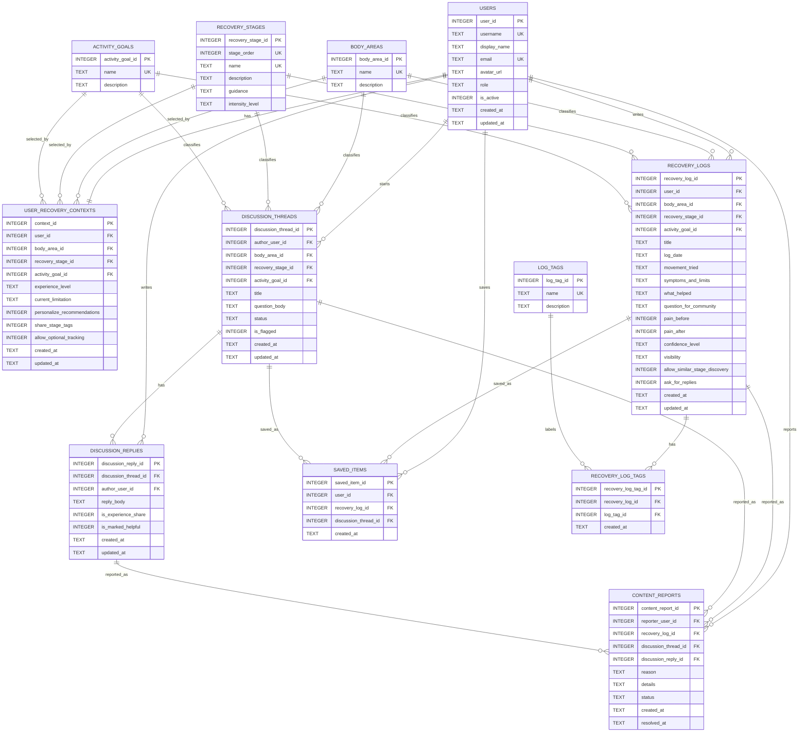

# Recovery Hub ERD 与表结构清单

## 1. ERD

## 2. 表结构清单

### `users`

- PK: `user_id`
- Unique: `username`, `email`
- 字段类型：`INTEGER`, `TEXT`
- 需要 index：unique 本身会生成索引；当前不额外添加。
- 用途：登录后的当前用户、作者、回复者、举报者。

### `body_areas`

- PK: `body_area_id`
- Unique: `name`
- 字段类型：`INTEGER`, `TEXT`
- 需要 index：unique 本身会生成索引。
- 用途：Knee、Ankle、Hip 等恢复部位。

### `recovery_stages`

- PK: `recovery_stage_id`
- Unique: `stage_order`, `name`
- 字段类型：`INTEGER`, `TEXT`
- 需要 index：unique 本身会生成索引。
- 用途：Early Recovery、Controlled Return 等阶段。

### `activity_goals`

- PK: `activity_goal_id`
- Unique: `name`
- 字段类型：`INTEGER`, `TEXT`
- 需要 index：unique 本身会生成索引。
- 用途：Return to running、Walk without pain 等目标。

### `user_recovery_contexts`

- PK: `context_id`
- FK:
  - `user_id -> users.user_id`
  - `body_area_id -> body_areas.body_area_id`
  - `recovery_stage_id -> recovery_stages.recovery_stage_id`
  - `activity_goal_id -> activity_goals.activity_goal_id`
- Unique: `user_id`，保证每个用户当前只有一个 active context。
- 字段类型：`INTEGER`, `TEXT`
- Index:
  - `idx_user_context_stage`
  - `idx_user_context_body_area`
  - `idx_user_context_goal`
- 重要说明：这里不保存 pain level；pain level 从最新 `recovery_logs` 推导。

### `recovery_logs`

- PK: `recovery_log_id`
- FK:
  - `user_id -> users.user_id`
  - `body_area_id -> body_areas.body_area_id`
  - `recovery_stage_id -> recovery_stages.recovery_stage_id`
  - `activity_goal_id -> activity_goals.activity_goal_id`
- 字段类型：`INTEGER`, `TEXT`
- Index:
  - `idx_recovery_logs_user_date`
  - `idx_recovery_logs_stage_body_goal`
  - `idx_recovery_logs_visibility_created`
- 用途：Structured Recovery Log Form 的核心表，也是 latest pain state 的数据来源。

### `log_tags`

- PK: `log_tag_id`
- Unique: `name`
- 字段类型：`INTEGER`, `TEXT`
- 需要 index：unique 本身会生成索引。

### `recovery_log_tags`

- PK: `recovery_log_tag_id`
- FK:
  - `recovery_log_id -> recovery_logs.recovery_log_id`
  - `log_tag_id -> log_tags.log_tag_id`
- Unique: `(recovery_log_id, log_tag_id)`
- 字段类型：`INTEGER`, `TEXT`
- Index:
  - `idx_recovery_log_tags_log`
  - `idx_recovery_log_tags_tag`
- 多对多说明：`recovery_logs` 和 `log_tags` 是多对多，所以拆成 junction table `recovery_log_tags`。

### `discussion_threads`

- PK: `discussion_thread_id`
- FK:
  - `author_user_id -> users.user_id`
  - `body_area_id -> body_areas.body_area_id`
  - `recovery_stage_id -> recovery_stages.recovery_stage_id`
  - `activity_goal_id -> activity_goals.activity_goal_id`
- 字段类型：`INTEGER`, `TEXT`
- Index:
  - `idx_discussion_threads_stage_body_goal`
  - `idx_discussion_threads_status_created`
- 用途：Explore 和 Detail 中的 question / discussion 内容。

### `discussion_replies`

- PK: `discussion_reply_id`
- FK:
  - `discussion_thread_id -> discussion_threads.discussion_thread_id`
  - `author_user_id -> users.user_id`
- 字段类型：`INTEGER`, `TEXT`
- Index:
  - `idx_discussion_replies_thread_created`
- 用途：Detail view 回复列表和新增回复。

### `saved_items`

- PK: `saved_item_id`
- FK:
  - `user_id -> users.user_id`
  - `recovery_log_id -> recovery_logs.recovery_log_id`
  - `discussion_thread_id -> discussion_threads.discussion_thread_id`
- 字段类型：`INTEGER`, `TEXT`
- Index:
  - `idx_saved_items_user`
- 约束：一条 saved item 只能指向一个 log 或一个 thread，不能同时为空或同时存在。

### `content_reports`

- PK: `content_report_id`
- FK:
  - `reporter_user_id -> users.user_id`
  - `recovery_log_id -> recovery_logs.recovery_log_id`
  - `discussion_thread_id -> discussion_threads.discussion_thread_id`
  - `discussion_reply_id -> discussion_replies.discussion_reply_id`
- 字段类型：`INTEGER`, `TEXT`
- Index:
  - `idx_reports_status`
- 约束：一条 report 只能指向一个目标内容。

## 3. SQLite 约束策略

- 所有主键使用 `INTEGER PRIMARY KEY`。
- 类 enum 字段使用 `TEXT + CHECK`，例如 `role`、`visibility`、`confidence_level`、`status`。
- 0/1 状态使用 `INTEGER + CHECK (field IN (0, 1))`。
- 时间使用 `TEXT` 存储，并使用 `datetime('now')` 或 `date('now')` 作为默认值。
- 所有筛选高频字段都添加 index，支持 list view 和 Explore 查询。
